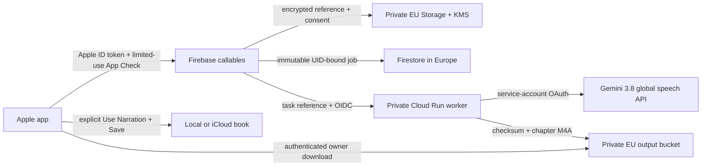

# Private parent voice narration

Implementation date: 2026-10-02. The fixed speech model is `gemini-3.8-flash-tts`. New voice enrollment requires separate adult reference and provider-verbatim consent recordings, explicit retention acceptance, and listening/approval before full book synthesis. The backend uses Gemini Enterprise OAuth with attached service accounts; no Gemini API key is shipped in the app. Firebase AI Logic does not expose the required persistent voice-creation contract, so Firebase callables wrap a private Cloud Run worker.

## Flow and ownership

Every callable derives UID from verified, non-revoked Firebase authentication and requires the `apple.com` sign-in provider. App Attest is configured before Firebase initialization. Limited-use App Check tokens are consumed and replayed tokens rejected. Recent Apple reauthentication is required for voice/account deletion; account deletion also revokes the Apple authorization before requesting durable backend cleanup.

Client-readable metadata lives only below `users/{uid}/voices` and `users/{uid}/jobs`, with writes denied. The immutable manuscript, provider mapping and enrollment records stay below backend-only `privateAccounts/{uid}`. Reference/consent audio uses a random AES-256-GCM data key wrapped by KMS; authenticated context binds the owner, voice, purpose and KMS key. Provider IDs remain encrypted and backend-only. Global Google speech processing is explicit; European app storage does not imply European-only model processing or zero provider retention.

The worker enforces owner checks independently because Admin SDKs bypass Firebase rules. Cloud Run requires IAM authentication; only queue/scheduler identities can invoke it. Each provider call, checkpoint and publication checks active account/voice state. Account tombstones, leases, cancellation flags and immutable request IDs prevent late tasks from recreating deleted data or publishing cancelled jobs. Uncertain voice creation is reconciled rather than blindly retried. Provider errors are mapped to safe codes; recordings, text, OAuth tokens and provider request bodies are not logged.

Output reads require the same UID, an active account, a ready job and an unexpired object. Clients use authenticated Storage SDK file downloads, never permanent download tokens or signed playback URLs. Bytes and SHA-256 are checked before preview/import. The app validates UID/session generation after every asynchronous boundary, clears listeners/downloads/private caches on sign-out, and uses an in-memory Firestore cache. An unresolved submission UUID is saved privately before sending to recover the same accepted job after an ambiguous timeout. Daily cleanup independently retries pending voice/account deletion after bounded queue retries end, and repeatedly removes late orphan writes under permanent deletion tombstones. A private fairness cursor prevents one unavailable provider operation from starving other owners.

## Book behavior and retention

Six delivery styles cover natural, gentle, curious, excited, reassuring and whispered narration. A frozen narration snapshot keeps supplied words separate from style instructions; paragraph boundaries and overrides are shared between UI and payload generation. Preview jobs are server-marked and cannot become a complete book. A full result can attach only when its text/settings snapshot still matches, all expected chapters pass audio validation, and its account remains active. Existing recordings survive failed, cancelled or incomplete attachment.

Encrypted source/consent recordings remain while a voice is enabled, to renew expired Google profiles. Cloud outputs/manuscripts/checkpoints expire after 30 days; rules deny access at expiry before daily cleanup deletes them. Abandoned enrollment sessions expire after one hour. Voice/account deletion fences new work, deletes provider voices and retained sources, and cleans cloud artifacts. Completed audio deliberately accepted into local/iCloud books remains governed by the user's library and ordinary file sharing.

Current cost limits are three voice profiles, five enrollment attempts/day, twenty previews/day, five books/day and one active complete-book job per UID. Complete books are bounded to 50,000 characters/5,400 words, with additional duration bounds in the worker. The API and worker reject unsupported input, oversized payloads and malformed audio. Queue delivery and the durable outbox resume accepted work after transient failures.

## Setup and enablement

Use two dedicated BedtimeStories projects, staging first and production second. The attempted staging identifier was `bedtime-stories-staging-mz`; **Google rejected creation because the personal account project quota is exhausted**. No project, worker, buckets, IAM resources or production rules were deployed. `.firebaserc` remains empty. Another app's project must not be substituted implicitly.

Backend setup contracts and commands are in [Functions](../backend/functions/README.md), [worker](../backend/WORKER.md), and [infrastructure](../backend/infra/README.md). Build/deploy the worker using its pinned dependencies and a private IAM service. Deploy Functions and rules explicitly to the confirmed project; keep `ENABLE_CLOUD_NARRATION=false`. Configure production App Check enforcement for Functions/Firestore/Storage and register the correct Apple app.

Sign in with Apple was enabled and read back for `com.matteozajac.bedtimestories` (App ID `RPW52LFS5Q`, team `4TCJLR98Y5`) as a primary App ID. An automatically refreshed development provisioning profile and the signed Release binary both contain the Apple sign-in entitlement, allow production App Attest, and preserve iCloud/Private Cloud Compute. App Attest uses the source entitlement rather than a separate portal capability. This is signed development-build evidence; physical-device authentication and App Store distribution remain unverified. Configure Firebase's Apple provider, including the OAuth credentials required for Apple token revocation, through the console/managed secret storage. Those credentials must not enter the repo.

Add the matching environment's `GoogleService-Info.plist` to the app bundle through secure build configuration. A Firebase client configuration identifies the project; it is distinct from administrative/Gemini credentials. If using a named output bucket, set `CloudNarrationOutputBucket` in build configuration. The app verifies Firebase options match its bundle ID. `CloudNarrationEnabled` is **false** in the checked-in Info.plist; merely adding configuration does not enable narration.

Before enabling staging, run the ADC-based [feasibility probe](../backend/scripts/voice_feasibility.py) using real, consenting adult reference and consent WAVs. Verify cloning, persisted voice reuse, English/Polish likeness, two delivery styles, WAV format and deletion using the actual worker identity. Listen to the result; successful HTTP calls alone do not prove likeness or emotion quality. Then validate deployed A/B authorization attacks, revocation, cancellation/deletion races, output expiry and absence of public/token URLs. Test Apple sign-in, App Attest, microphone/conversion, background/relaunch recovery and account switching on a physical device. Only enable customer access after these gates pass; no automatic model fallback is implemented.

## Local verification

The implementation has host tests for narration snapshots and the existing book format, native simulator tests for batch attachment and bounded recording conversion, Functions unit/emulator isolation tests, and Python worker tests for encryption, owner isolation, lease/checkpoint recovery and destructive races. See [the dated validation receipt](CLOUD_NARRATION_VALIDATION.md) for exact results and outstanding evidence. Emulator and simulator evidence do not establish live Google access, physical microphone/App Attest behavior or production privacy.

Primary contracts verified on 2026-10-02: [Google voice replication](https://docs.cloud.google.com/gemini-enterprise-agent-platform/models/text-to-speech/voice-replication), [Gemini 3.8 Flash TTS](https://docs.cloud.google.com/gemini-enterprise-agent-platform/models/gemini/3-8-flash-tts), [speech/style/output format](https://docs.cloud.google.com/gemini-enterprise-agent-platform/models/text-to-speech/overview), [Google retention](https://docs.cloud.google.com/gemini-enterprise-agent-platform/resources/zero-data-retention), [Firebase App Check replay protection](https://firebase.google.com/docs/app-check/cloud-functions), [Sign in with Apple and token revocation](https://firebase.google.com/docs/auth/ios/apple), [authenticated Storage downloads](https://firebase.google.com/docs/storage/ios/download-files).
