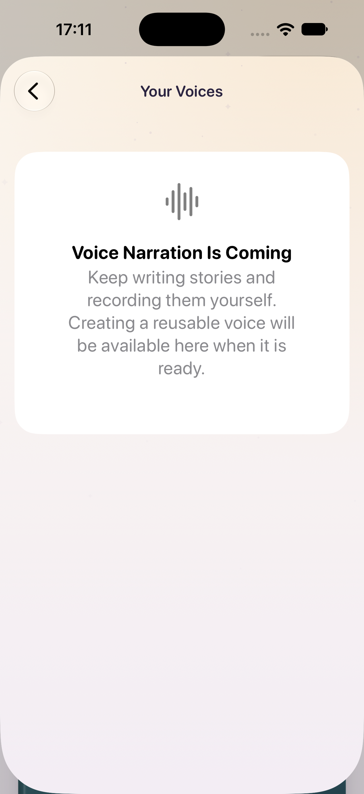

# Cloud narration implementation receipt

Date: 2026-10-02. Bundle: `com.matteozajac.bedtimestories`. Google speech model: `gemini-3.8-flash-tts`. Source implementation is complete locally; cloud customer access remains disabled.

## Verified evidence

| Check | Result |
| --- | --- |
| Native iOS 27 simulator suite | 32 tests in 4 suites passed, no failures/skips; includes owner switch/cancellation during transactional attachment, request-receipt UID isolation and retry recovery |
| Recording boundaries | Strengthened BookCreator suite: 13 tests passed; actual prepared mono PCM16 24 kHz WAV is at least 10 seconds, short and 31-second reference inputs rejected |
| Swift core | 3 narration snapshot XCTest tests + 8 existing Swift Testing tests passed; text/styles and portable format remain separate |
| Existing authoring interoperability | 6 Python authoring tests passed |
| Functions | 6 Node 22 unit tests passed; Apple/recent authentication, immutable task target/audience/deadline, hostile input and encryption binding |
| Firestore/Storage emulators | 12 isolation scenarios passed against `demo-bedtime-cloud`: A/B reads/writes, private sources, expiry, owner-bound idempotency, approval, cost/concurrency limits, tombstones and outbox recovery |
| Worker | 44 tests passed after deletion-fence/dependency fixes; includes scheduled recovery after finite queue retries, independent safe failures, fairness cursor and before-provider cost bounds |
| Infrastructure helpers | 6 tests passed; exact bucket/project identity, explicit Storage rules target, safe resource-only environment and disabled feature gate |
| Terraform | Official Terraform 1.14.0 archive checksum verified; signed Google/google-beta 8.2.0 providers installed; init without backend, schema validation and format check passed |
| Dependency audits | Node `npm audit` and Python `pip-audit -r backend/worker/requirements.txt` report no known vulnerabilities |
| Localization | All 327 pre-existing entries preserved; 118 cloud narration entries added in English and Polish, with placeholder/plural preservation |
| Source/config hygiene | `git diff --check`, plist and string-catalog validation pass; new source has no credential-like literal hits |
| Release compile | Unsigned device Release builds passed, including Firebase dependencies and strict concurrency |
| Signed development build | Release built with personal team and refreshed automatic profile; signed binary includes Apple sign-in, production App Attest, iCloud and managed Private Cloud Compute |
| Internal TestFlight 1.0 (8) | 32 native tests in Release passed; signed archive/Internal-only export verified; exact build `0b69f792-f2ac-4c37-b3d9-f5dd83cfdc73` read back `VALID` / `INTERNAL_ONLY` / `IN_BETA_TESTING`, with effective Internal Testers access and matching English notes |
| Apple portal | `APPLE_ID_AUTH` enabled/read back with `PRIMARY_APP_CONSENT` on App ID `RPW52LFS5Q`; existing capabilities preserved |
| Disabled-feature UI | RocketSim screenshot confirms Settings → Your Voices opens the unavailable state; existing local library remains visible |

The signed build's `CloudNarrationEnabled` is false and no `GoogleService-Info.plist` is bundled. The refreshed development profile expires on 2027-10-02. TestFlight build 8 separately verifies App Store distribution signing, including production App Attest, Apple sign-in, iCloud and PCC. Its automatic distribution profile UUID is `5abe4610-98c2-404b-89ee-2d87f303e113`; the profile expires on 2027-08-09 and the reused signing certificate on 2027-03-05. These checks do not establish physical-device behavior. Xcode reported existing UIKit appearance concurrency warnings in the initial builds and the benign AppIntents metadata warning; final app compilation had no errors.

Native implementation receipt: `/tmp/BedtimeCloudBuild/Logs/Test/Test-BedtimeStories-2026.10.02_17-14-19-+0200.xcresult`. Release regression receipt: `/tmp/BedtimeStories-1.0-8-release-tests.xcresult`. Build/export/upload/readback evidence and the stable 113-input fingerprint are in `/tmp/BedtimeStories-1.0-8-release/`; the durable upload identity and hashes are in [TESTFLIGHT.md](TESTFLIGHT.md). Host logs are temporary evidence, not repository secrets. Repeatable commands are in the [Functions guide](../backend/functions/README.md), [worker guide](../backend/WORKER.md) and [infrastructure guide](../backend/infra/DEPLOYMENT.md).

## Deployment and live gates

Google rejected creation of `bedtime-stories-staging-mz`: **“The project cannot be created because you have exceeded your allotted project quota.”** No Google projects/resources were provisioned or deployed, and production creation was not attempted after this rejection. `.firebaserc` remains empty. Existing unrelated app projects were not repurposed.

Pending: resolve dedicated staging/production project capacity; provision private infrastructure, explicitly registered audio bucket/rules and runtime IAM; configure Firebase Apple provider/token revocation and production App Attest; verify Gemini access and stored-voice limits with the actual worker identity; use a consenting adult's real reference/consent recordings for English/Polish likeness/style/deletion checks; run deployed A/B access and destructive-race probes; verify microphone, account switching, recovery and authenticated import on a physical device. No live cloning or narration result exists from this implementation. The disabled client is distributed as Internal TestFlight 1.0 (8); both existing tester records still report build 7.
